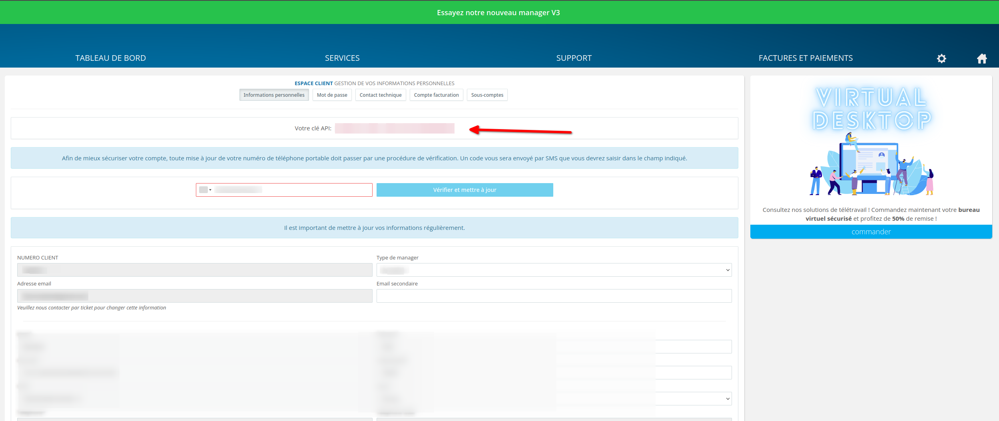

<p align="center">
  
</p>

Hosteur ACME WebHook

**Before you install you need to create Hosteur Issuer Secret**

* CLIENTID is you Hosteur's Client ID 
* APIKEY can be found from Hosteur's Manager > Gestion des comptes > Informations Personnelles



How to install

```
echo "CLIENTID" | base64
echo "APIKEY" | base64
git clone git@github.com:hosteur-sa-ch/cert-manager-webhook-hosteur.git
cd cert-manager-webhook-hosteur
# <cert-manager-service-account-name> est le nom du service cert-manager controller
helm install cm-webhook-hosteur ./deploy/webhook --set certManager.serviceAccountName=<cert-manager-service-account-name> --namespace cert-manager
kubectl apply -f usage-exemple/issuer.exemple.yaml
```
